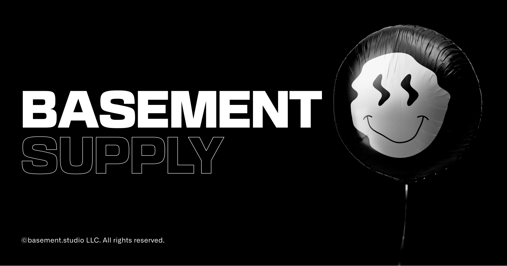

# basement.studio challenge ☠



## Challenge details

Tenemos que implementar el diseño de [este figma](https://www.figma.com/file/BYjaSbdPyhEL0ucneDlIQ0/Dev-Challenge?node-id=1%3A218) (el equipo de diseño trabajó mucho en el figma, para esta primera etapa podemos omitir detalles mientras todo ande), como el backend todavía no está desarrollado el cliente nos dejó un mock en `/product/mock.json`.

El checkout no está listo tampoco así que con imprimir en consola el pedido al clickear en `CHECKOUT` alcanza.

El cliente quiere que usemos NextJS, TypeScript y Tailwind, pero por suerte nos dió el proyecto con todo ya configurado. También nos dejó instalada su fuente y algunos assets en la carpeta `public`.

También nos dijo que no era requerido, pero nos iba a pagar un importante bono por cada punto extra:

- Tests de integración con Cypress
- Tests unitarios con Jest y React Testing Library
- Guardar el cart del usuario en localStorage
  - Nos aseguró que los productos siempre van a estar y nunca se van a modificar, así que podemos guardalos como queramos.

También nos dijo que nos iba a pagar bonos por cualquier idea original que se nos ocurra agregar.

Nos pidió que el código sea lo más prolijo posible, para que cuando el backend este implementado los cambios sean mínimos para poder integrarlo.

Como el cliente no sabe de desarrollo nos pidió que despleguemos nuestra aplicación en algún lado y le mandemos un link para ver el progreso.

## Corriendo el proyecto

```bash
# Instalar dependencias del proyecto
npm install

# Correr el servidor de desarrollo
npm run dev
```

## Preview 📸


